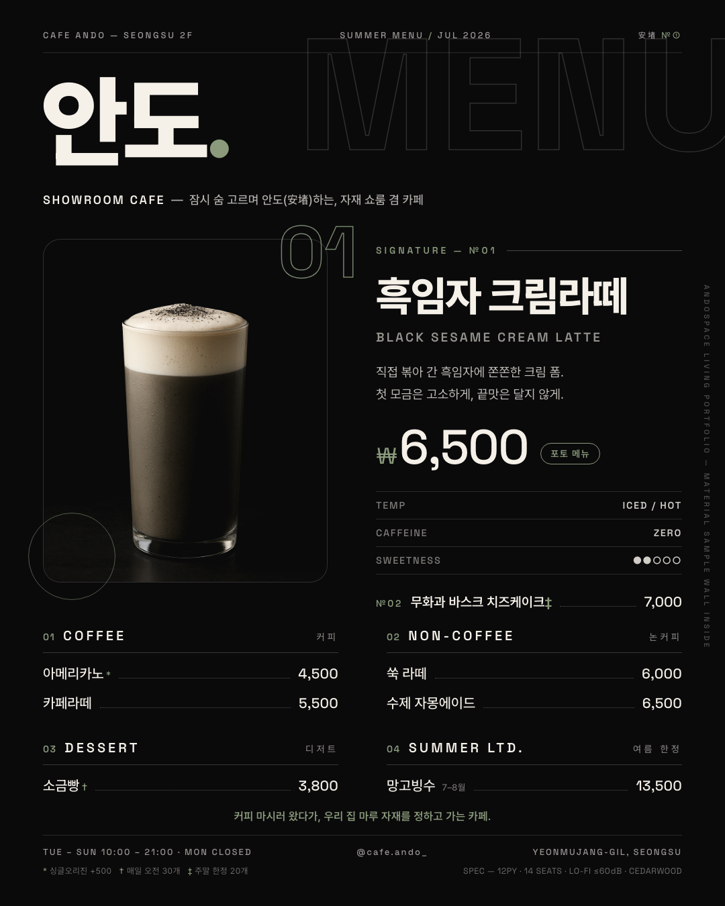

# ☕ 카페 안도 — 메뉴판 (Apple × Tesla × 포스트모던)

week-7 퀘스트: 카페 컨셉 → 메뉴 구성 → 메뉴판 디자인 → 공유.
데이터 원본은 [`week-5/my-cafe/my_cafe.md`](../../week-5/my-cafe/my_cafe.md) (카페 안도 정의서) — 메뉴·가격·브랜드 컬러 전부 정의서 그대로.



---

## Part 1 — 컨셉

| 항목 | 내용 |
|---|---|
| 카페 이름 | **카페 안도 (Cafe Ando)** — 인테리어 회사 안도공간이 운영하는 자재 쇼룸 겸 카페 |
| 분위기 | 미니멀 × 테크 — 그래파이트 다크에 크림·세이지만 얹은 "제품 발표회장 같은 카페" |
| 타겟 손님 | 성수 직장인 서른들 + 공간·디자인 덕후 (조용한 2층에서 사진 찍고 오래 머무는 손님) |

### 컬러 팔레트 (3색)

| 색 | 값 | 역할 |
|---|---|---|
| 그래파이트 | `#0A0A0B` | 배경 (Tesla 다크) |
| 크림 화이트 | `#F5F0E8` | 타이포 — **기존 브랜드 컬러 유지** |
| 세이지 그린 | `#8A9A7B` | 시그니처 강조색 — **기존 브랜드 컬러 유지** |

### 폰트 (2개)

- **Pretendard** — 한글 제목/본문 (Apple SD Gothic 계열의 시스템 감성)
- **Space Grotesk** — 숫자·라벨·가격 (Tesla 스펙시트 감성)

## Part 2 — 메뉴 (5카테고리 · 8메뉴)

| 카테고리 | 메뉴 | 가격 |
|---|---|---:|
| 시그니처 | **★ 흑임자 크림라떼** (포토 메뉴) | 6,500 |
| 시그니처 | 무화과 바스크 치즈케이크 (주말 20개) | 7,000 |
| 커피 | 아메리카노 (싱글오리진 +500) | 4,500 |
| 커피 | 카페라떼 | 5,500 |
| 논커피 | 쑥 라떼 | 6,000 |
| 논커피 | 수제 자몽에이드 | 6,500 |
| 디저트 | 소금빵 (매일 오전 30개) | 3,800 |
| 여름 한정 | 망고빙수 (7–8월) | 13,500 |

시그니처 = **흑임자 크림라떼** 1개에만 시각적 무게(사진 + 세이지 강조 + 스펙 테이블)를 몰아줬다.

## Part 3 — 디자인 (1080×1350)

스타일 레퍼런스 3개를 이렇게 녹였다:

- **Apple** — 넉넉한 여백, 헤어라인 디바이더, 블랙 배경 제품사진(순흑 배경을 `mix-blend-mode: lighten`으로 캔버스에 녹임)
- **Tesla** — 그래파이트 다크, 대문자 트래킹 라벨, TEMP/CAFFEINE/SWEETNESS 스펙 테이블, 푸터 SPEC 스트립
- **포스트모던** — 초대형 아웃라인 "MENU" 레이어링, №01 오버사이즈 넘버, 회전 세로 텍스트, `* † ‡` 각주 시스템

가격은 전부 **오른쪽 정렬** + 도트 리더.

### 산출물

- `out/menu-board.png` — 1080×1350 (인스타 규격)
- `out/menu-board@2x.png` — 2160×2700 (고해상도)

## 이미지 생성 (fal.ai → OpenAI 폴백)

`generate-hero.mjs` — 시그니처 히어로 컷 생성 스크립트. **fal.ai(`flux/dev`) 우선** 호출 구조인데,
2026-07-19 실행 시점에 fal 계정 잔액 소진(`403 Exhausted balance`)이라 **gpt-image-1 폴백**으로 2컷 생성 후 베스트 컷(hero-2) 채택.
fal 잔액 충전 후 같은 스크립트를 다시 돌리면 fal 4컷으로 교체된다. (키: `week-3/class/my-midjourney/.env` 재사용)

## 재현

```bash
node generate-hero.mjs   # 히어로 컷 생성 (fal.ai → OpenAI 폴백)
./render.sh              # menu.html → out/*.png (헤드리스 Chrome)
```

> gotcha: `--headless=new`가 스크린샷을 쓰고도 프로세스가 안 죽는다 → render.sh가 파일 생성을 감지해 직접 kill.

---

## 제출용 — 컨셉 한 단락

> 카페 안도는 인테리어 회사 안도공간이 성수동 골목 2층에 직접 지은 **자재 쇼룸 겸 카페**다. 이번 메뉴판은 "제품 발표회장 같은 카페"라는 한 문장에서 출발했다 — Apple 키노트의 여백과 블랙 제품사진, Tesla 스펙시트의 대문자 라벨과 수치 테이블, 포스트모던 그래픽의 초대형 아웃라인 타이포를 겹쳐, 시그니처 **흑임자 크림라떼** 한 잔을 신제품 발표하듯 무대에 올렸다. 색은 기존 브랜드 컬러(크림 `#F5F0E8`·세이지 `#8A9A7B`)에 그래파이트(`#0A0A0B`) 하나만 더한 3색, 폰트는 Pretendard + Space Grotesk 2종. 메뉴와 가격은 카페 안도 정의서(my_cafe.md)를 그대로 따랐고, 흑임자의 검정–크림 레이어가 곧 메뉴판 팔레트가 되도록 설계했다.
