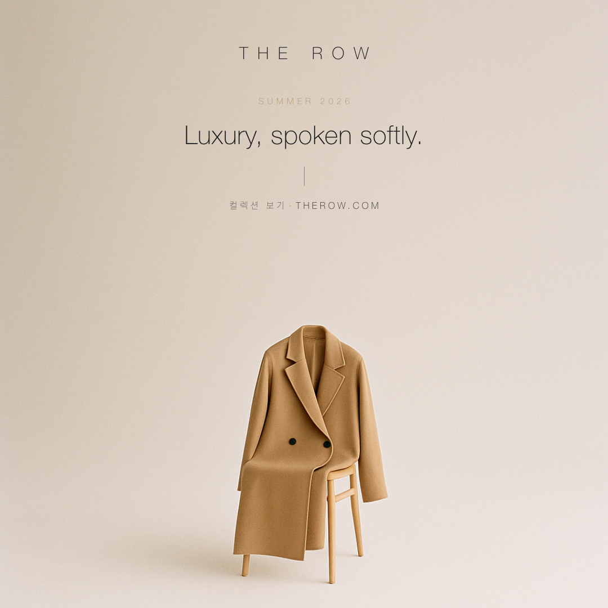
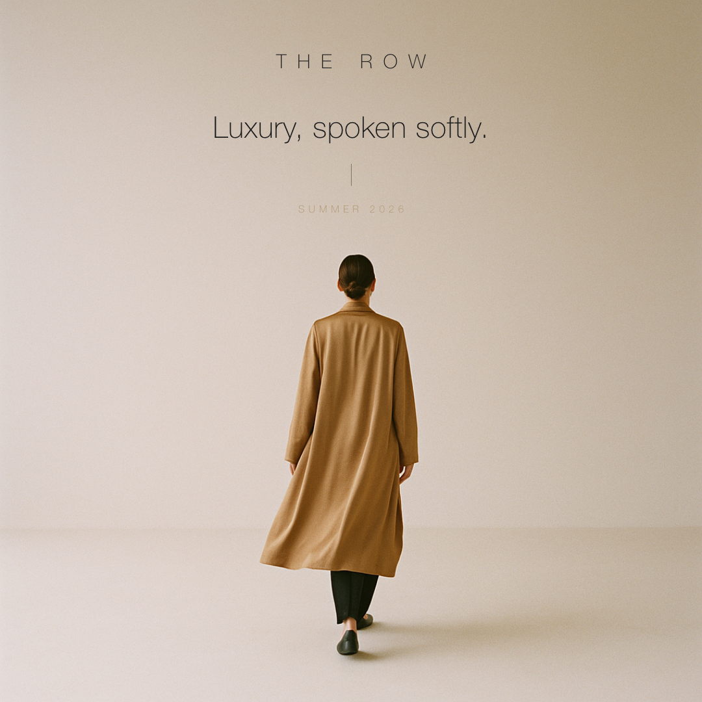
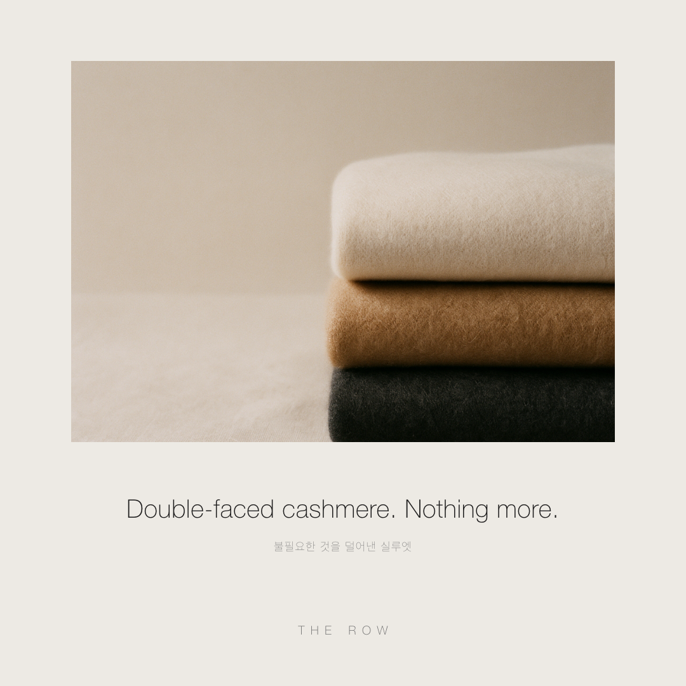
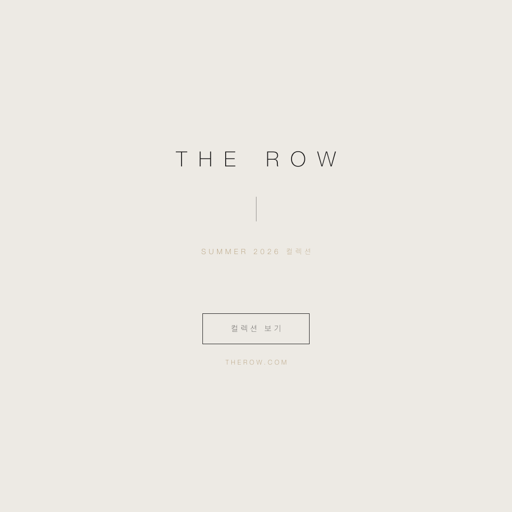
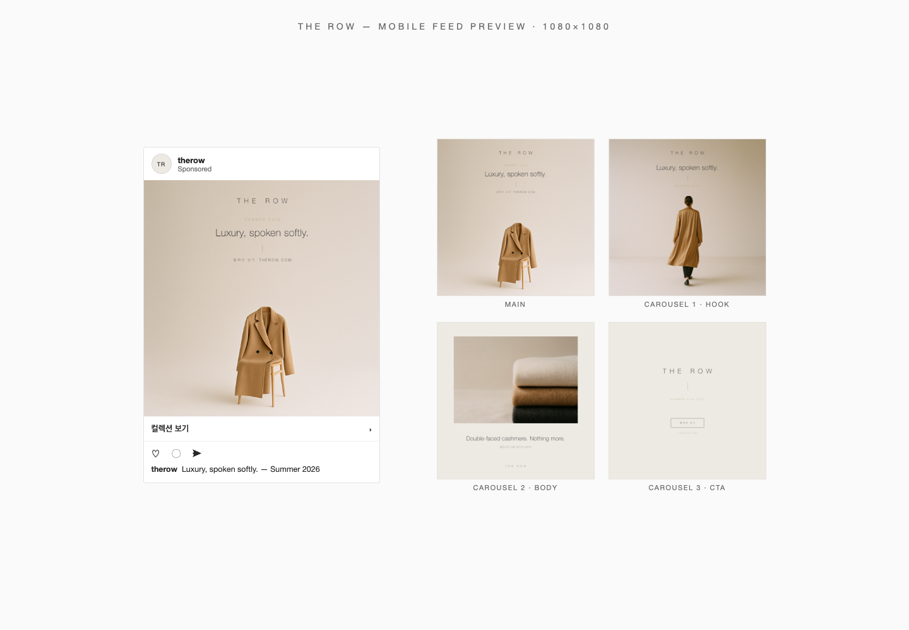

# The Row — 인스타그램 광고 카드 🖤

> week-7 미션: 좋아하는 브랜드의 톤앤매너로 1080×1080 인스타그램 광고 카드 디자인
> 선정 브랜드: **The Row** (therow.com/ko-kr) — 콰이어트 럭셔리의 정점

| 결과물 | 파일 | 구조 |
|---|---|---|
| **메인 광고 카드** | `cards/main.png` | 한 줄 카피 + 비주얼 + CTA |
| 보너스 캐러셀 1 | `cards/carousel-1.png` | 후킹 (비주얼+카피) |
| 보너스 캐러셀 2 | `cards/carousel-2.png` | 본문 (소재 스토리) |
| 보너스 캐러셀 3 | `cards/carousel-3.png` | CTA (타이포 온리) |
| 모바일 피드 미리보기 | `preview/feed-preview.png` | 375px 포스트 목업 + 250px 그리드 |

## 미션 요구사항 체크

- ✅ **1080×1080 고정** — 헤드리스 Chrome `--window-size=1080,1080 --force-device-scale-factor=1` 로 픽셀 정확 렌더 (sips 검증)
- ✅ **컬러 일관성** — 메인 2색 Ivory `#EDEAE4` + Ink `#1C1B1B`, 보조 1색 Camel `#A98E64` (사이트 CSS 변수·캠페인 이미지 실측 → `BRAND.md`)
- ✅ **폰트 일관성** — 실제 웹폰트 Basic Commercial(그로테스크)의 로컬 대체 Helvetica Neue Light + Apple SD Gothic Neo Light, 워드마크는 자간 0.55em 얇은 대문자(로고 실측 재현)
- ✅ **슬로건/보이스** — 공식 슬로건이 없는 브랜드라 절제된 평서문으로 창작: **"Luxury, spoken softly."** (3단어, 3~7단어 규칙 충족)
- ✅ **한 줄 카피 + 비주얼 + CTA** — 메인 카드에 3요소 모두. CTA는 브랜드답게 채운 버튼 없이 `컬렉션 보기 · THEROW.COM` 헤어라인 텍스트
- ✅ **여백** — 캠페인 문법 그대로 화면의 70%+ 를 여백으로
- ✅ **작은 사이즈 미리보기** — `preview/feed-preview.png` (모바일 375px + 그리드 250px 가독성 확인)
- ✅ **보너스: 3장 캐러셀** — 후킹 → 본문 → CTA

## 프로세스

1. **브랜드 분석** (`BRAND.md`) — therow.com/ko-kr HTML/CSS 실측: 웹폰트 `@font-face`(Basic Commercial), CSS 컬러 변수(`#1C1B1B`/`#6A6A6A`), og:image 워드마크, Summer 2026 캠페인 히어로 이미지 톤 분석
2. **비주얼 생성** (`generate-visuals.mjs`) — OpenAI **gpt-image-1** (1024², high) 3장:
   - `v1-coat-chair` 카멜 코트+비치우드 체어 (메인)
   - `v2-texture` 캐시미어 스택 매크로 (캐러셀 본문)
   - `v3-figure` 뒷모습 피겨 워킹 (캐러셀 후킹 — 실제 Summer 2026 캠페인 문법)
3. **카드 컴포지팅** (`src/*.html` + `src/style.css`) — 텍스트는 AI에 맡기지 않고 HTML 타이포로 정밀 조판 (폰트/자간 일관성). 텍스트 상단 스택은 therow.com 홈 히어로와 동일한 문법
4. **렌더** (`render.sh`) — 헤드리스 Chrome → 1080×1080 PNG + 피드 프리뷰

## 재생성

```bash
node generate-visuals.mjs              # 비주얼 3장 전부 (OPENAI_API_KEY 필요)
node generate-visuals.mjs v2-texture   # 특정 비주얼만
./render.sh                            # 카드 4장 + 프리뷰 렌더
```

## 결과

| MAIN | HOOK | BODY | CTA |
|---|---|---|---|
|  |  |  |  |



> `assets/_ref-*.jpg/png` 는 톤 분석용 원본 레퍼런스(캠페인 히어로·워드마크), `assets/v*.png` 가 AI 생성 비주얼.
