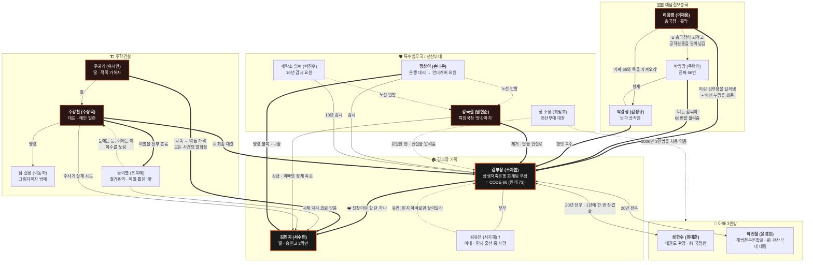

# 김부장 (Agent Kim Reactivated)

> **세상에서 가장 평범한 아빠가, 하나뿐인 딸을 되찾기 위해 세상에서 가장 위험한 남자가 된다.**
> — SBS 금토드라마 (2026) · 소지섭 주연 · 아빠 유니버스 복수 액션 느와르

> ⚠️ **동명이인 주의**: JTBC 「서울 자가에 대기업 다니는 김 부장 이야기」(류승룡 주연)와는 **완전히 다른 작품**이다.
> 이 문서는 **SBS 액션 스릴러 「김부장」(소지섭)** 만을 다룬다.

> 📌 이 문서의 핵심 목적은 **[톤 & 비주얼](#톤--비주얼-포스터-제작용-)** 섹션이다. 포스터 디자인에 직접 쓸 근거를 모았다.
> 작성 기준일: **2026-07-14** (6회까지 방영, 7~10회 미방영)

---

## 기본 정보

| 항목 | 내용 |
|---|---|
| **제목(한)** | 김부장 |
| **제목(영)** | Agent Kim Reactivated  ※ 원작 웹툰 영어판은 〈Manager Kim〉으로 **다름** |
| **기타 언어** | 日 エージェント・キム: リアクティべーティッド · 中 金特務本色回歸 · 泰 สายลับคิมกลับมาแล้ว · 西 Agente Kim reactivado · 葡 Agente Kim: Reativado |
| **장르** | 액션, 범죄, 스릴러, 미스터리, **느와르**, 첩보, 수사, 오피스, **코미디** |
| **원작** | 네이버웹툰 「김부장」 (2021.11.01~) — **박태준 유니버스 5번째 작품**  · **스토리: 토이 → 남자의 이야기** (연재 중 교체)  · **작화: 정종택**  · 연출·콘티: 갸오오 / 제작총괄: 박태준 / 출판: 박태준 만화회사  · 드라마 크레딧 표기: `더그림엔터테인먼트, 남자의이야기, 정종택 웹툰 〈김부장〉` |
| **방송사** | SBS TV (추가채널: SBS Plus, SBS funE, SBS LIFE, ENA, CNTV) |
| **방영기간** | **2026년 6월 26일 ~ 2026년 7월 25일 (예정)** — 「멋진 신세계」 후속 |
| **방송시간** | **금·토 21:50 ~ 23:10** |
| **부작** | **10부작** (당초 8부작 편성 예정 → 촬영 중 변경) + **스페셜 2부작** |
| **극본** | **남대중** (영화 「위대한 소원」·「기방도령」 각본) |
| **연출** | **이승영, 이소은** |
| **제작사** | **스튜디오S, 판타지오** / 기획: SBS·스튜디오S (기획 이광순)  ※ 네이버웹툰 영상화 전담 **스튜디오N은 미참여** |
| **주요 스태프** | 촬영 조대근·한상규·조호수 / **미술 한지선** / **음악 김성율** / 제작 홍성창·김철민·남궁정 |
| **주연** | **소지섭**, 최대훈, 윤경호, 주상욱, 손나은 |
| **OTT** | **NETFLIX** (동시 공개) |
| **촬영 기간** | 2025년 11월 ~ 2026년 5월 |
| **시청 등급** | 15세 이상 시청가 (주제, 폭력성, 언어, 모방위험) |
| **포맷 / 협찬** | UHD / 차량 협찬 **폴스타(Polestar)** |
| **OST** | Part1 `GO! GO!` — ALPHA DRIVE ONE (06.26)  Part2 `Your Anchor` — 서영주 of 너드커넥션 (06.27)  Part3 `Revenant` — 블라세 (07.04) |

### 박태준 유니버스(PTJ Universe) 연계
원작은 **「외모지상주의」·「싸움독학」·「인생존망」의 세계관을 잇는 공식 스핀오프**다.
영문 위키백과에 따르면 등장인물의 출신 작품은 다음과 같다.

| 인물 | 원 출신작 |
|---|---|
| 김부장 | **외모지상주의(Lookism)** 의 조역 → 「김부장」의 주인공으로 승격 |
| 박진철 | 인생존망(My Life as a Loser) |
| 성한수 | 싸움독학(Viral Hit) |

---

## 줄거리

### 전체 시놉시스 (스포일러 없음)

상생저축은행 회계팀 부장 **김부장**. 동네 건달에게 멱살을 잡혀도 참고, 부지점장에게 면박을 당해도 삭이는, 세상에서 가장 평범한 중년이자 딸 하나만 보고 사는 홀아비다.

그러나 그에게는 세상에 절대 알려져서는 안 될 과거가 있다. 그는 **북한이 길러낸 공작원이었다가 대한민국에 포섭돼 귀순한 뒤, 천산부대 소속 블랙 요원으로 살아온 전설의 특수요원 '코드네임 66'** 이다. 북한에겐 일급 수배 대상이고, 남한에겐 존재가 드러나선 안 될 시한폭탄이다.

딸의 생일을 앞둔 어느 날, **딸 민지가 소리소문 없이 사라진다.** 딸을 찾기 위해 김부장은 스스로 봉인했던 정체를 드러내고, 그 순간부터 **남과 북 양쪽 모두에게 쫓기는 신세**가 된다.

과거의 동료였던 태권도 관장 **성한수**, 해병전우연합회의 **박진철** — '아빠 3인방'이 다시 뭉친다. 그들 앞에는 재력과 폭력으로 세상을 지운다는 주학건설 대표 **주강찬**, 형의 복수를 위해 남파된 공작원 **박강성**, 그리고 김부장을 제거하려는 국가기관 **특수임무국**이 가로막는다.

### 기획의도 (SBS 공식, 원문)

> ‘세상에서 가장 평범한(?) 아빠가 온다!’
> 열심히 살아온 그에게 세상이 붙여준 이름은 노땅, 꼰대, 개저씨 같은 조롱뿐.
> 하지만 자식에게 부끄럽지 않은 아빠가 된다면, 밖에서는 부끄러운 사람이 되어도 상관없다.
> ‘김부장’은 자기 이름 대신 ‘가장’이라는 무게를 묵묵히 견뎌온 아버지들에게 당신이 가진 존재와 힘을 다시 한번 각인 시켜주고 싶었다. 사회에서는 투명인간처럼 취급당해도 가족 앞에서는 언제나 버팀목이었던 이들의 뒷모습이 얼마나 멋진지 보여주고 싶었다. 가장 평범해 보이지만, 그래서 더 위대한 중년 아저씨 ‘김부장’을 통해 갑갑한 속을 적셔주는 시원한 맥주같은 탈출구가 되었으면 좋겠다.

원작 웹툰의 로그라인은 더 짧고 강하다.

> **제발 안경 쓴 아저씨는 건들지 말자...**

---

### 상세 줄거리

> 🚨 **스포일러 경고** — 아래는 6회까지 방영분의 핵심 반전을 전부 포함한다.

#### 발단 — 학교폭력
딸 **김민지**(송인고 2학년)는 주학건설 회장의 딸 **주혜리**에게 지속적인 학교폭력을 당한다. 혜리가 관심 있던 배구부 **김남훈**이 민지와 가까워지자 앙심을 품고 체육관에서 린치를 가하지만, 오히려 민지에게 얻어맞는다. 혜리는 아빠의 권력으로 **피해자 코스프레**를 하고, 김부장은 학폭위 교무실에서 **딸이 보는 앞에서 주강찬에게 무릎을 꿇고 빈다.** "아빠는 자존심도 없냐"며 민지는 가출하고 — 그날 밤 사라진다.

민지는 혜리 무리에게 **벽돌로 뒤통수를 맞고** 쓰러졌고, 죽은 줄 안 그들이 철거용역 **금이빨**에게 시체 처리를 의뢰한 상태였다.

#### 각성 — 코드네임 66
공사장 폐건물에서 혈흔과 혜리의 헤어끈을 발견한 김부장은 은폐 세력과 대치한다. 상대가 셔츠를 찢자 **온몸을 뒤덮은 총상과 칼자국**이 드러나고, 김부장은 **뿔테 안경을 벗어 던지고** 순식간에 제압한다. "우리 민지 어딨어!"

그의 정체는 **북파 임무만 17회, 남파 이중간첩 5회, 북한 최고사령관 암살미수** 기록을 가진 전설의 공작원. 중국과 러시아에도 전담 팀이 있을 만큼의 존재다.

#### 66의 진실 — 원래 그는 73번이었다
금강보육소 시절, "사회체육단원으로 뽑아준다"는 거짓말에 속아 강제 징집된 소년들. 반 전체를 때려눕히고 뽑힌 **박영광**이 **66번**, 그 바짓가랑이를 붙잡고 늘어진 독기를 인정받아 함께 뽑힌 김부장이 **73번**이었다.

처음엔 김부장이 질투해 박영광의 주먹밥을 뿌리쳤지만, 나중에 김부장이 강해지자 똑같이 배식을 나눠주며 놀렸고 박영광은 넙죽 받아먹으며 "동무끼리 그런 게 어딨네"라 했다. 둘은 **유일한 동무**가 됐다.

강원도 침투 작전에서 함정에 빠져 일행이 전멸하고 박영광은 다리를 잃는다. 같이 죽자는 김부장을 만류하며 박영광은 유언을 남긴다 — **"죽지 말라. 그 지옥 같은 생활 우리가 어떻게 버텼냐. 살아남기 위해 아니었냐. 무슨 일이 있어도 꼭 살아남으라."** 그리고 이름조차 잊은 김부장에게, 자기 성도 잊은 66이 이렇게 말한다 — **"너는 김씨야."**

**이것이 '김'부장의 유래다.** 김부장은 죽은 전우의 번호 **66**으로 살아간다. 북한에는 "배신하고 66을 죽인 뒤 번호를 빼앗았다"고 알려진다.

**최대 반전(5회)**: 그 작전 자체가 **대남첩보총국 리응령이 총국장 자리를 차지하려 자기 공작원들을 대한민국에 팔아넘긴 자작극**이었다. 배신 서사 전체가 거짓말이었다.

#### 아내의 유언
과거, 남북회담 방해공작 중이던 부국장 김정선을 암살한 김부장은 산부인과로 달려갔으나 아내 **림유진**은 민지를 낳고 후유증으로 사망한 뒤였다. 유언은 **"그 아이를 지키기 위해서라면 무엇이든지 해주세요"** — 과거를 잊고 민지 아빠로만 살아달라는 것. 김부장은 장 소장을 인질로 잡아 전역에 성공하고 과거를 봉인했다. (민지의 생일은 곧 엄마의 기일이다.)

#### 추격과 삼각 대치
박진철의 술집 난동 영상이 퍼지며 **김부장의 생존이 북에 노출**된다. 리응령은 박영광의 동생 **박강성**에게 "남조선의 가짜 66의 목을 가져오라" 지령을 내려 남파한다.

동시에 은행 동료 **정상아**와 이웃 세탁소 **임씨**가 실은 **10년간 김부장을 감시해온 특수임무국 언더커버 요원**임이 드러난다. 특임국장 **강국철('땅강아지')** 은 "김부장의 약점은 딸"이라며 **민지를 먼저 인질로 확보하라**는 작전을 편다.

#### 민지의 생존과 자력 탈출
민지는 시신으로 오인돼 냉동창고에 유기됐으나 **살아 있었다.** "나 안 죽어 아빠, 난 반드시 살아서 집에 돌아갈 거야"라 다짐하며 **빠루로 금이빨을 내리치고** 폭우 속으로 탈출한다. 김부장은 컨테이너 위에서 도망치는 민지를 눈앞에 두고도 빗소리에 목소리가 묻혀 **끝내 엇갈린다.**

히치하이킹으로 올라탄 차는 하필 **주강찬의 차**였다. — "호재라는 말 알아? 뜻밖의 호재."

#### 6회 — 구출, 그리고 상봉
주강찬은 민지가 자는 척한 순간부터 연기를 간파하고 있었고, **주사기로 살해**하려 한다. 바늘이 닿기 직전 **정상아**가 별장 경호진을 홀로 무력화하고 은닉방의 민지를 구출한다. 다만 둘은 민지를 **특임국에 인도**한다.

특임국에 감금된 민지는 강국철에게 **"네 아빠는 북한 간첩"** 이라는 실체를 듣고 무너진다. **성한수**가 취조실에 맨몸으로 잠입해 민지를 안심시킨다 — 아빠가 간첩이었음은 인정하되, **"지금은 아니야."**

빗발치는 총격 속, 마침내 김부장이 나타난다. **"민지야, 아빠 왔다. 집에 가자."**

---

## 등장인물

### 주요 인물

#### 김부장 (소지섭 / 아역 홍동영) — 주인공
- **표면**: 상생저축은행 회계팀 부장. 1983년생(42세), 183cm. 망윤동 **도원세탁소 2층** 거주(감시자 임씨의 세탁소 위층!). 주부 9단 딸바보.
- **정체**: **CODE-66** (원래 **CODE-73**). 북한 금강보육소 출신 → 남파 공작원 → 대한민국 포섭·귀순 → **천산부대(중사)** 블랙 요원. **북파 17회 · 남파 이중간첩 5회 · 북한 최고사령관 암살미수**. 격투: 절권도, CQC, **은사(와이어)**.
- **본명**: **확인 안 됨** (드라마 미공개. 원작 웹툰에선 188화에서 **김태형**으로 밝혀짐)
- **역할**: 서사의 축. 딸의 실종이 봉인된 과거를 깨우는 유일한 스위치.

> ⚠️ **자주 틀리는 지점**: 김부장은 "남파공작원 출신"이지만, 극 중 화려한 과거 액션(1~2회 AI 시퀀스 포함)은 **남→북 '북파' 임무**다. 방향을 반대로 쓰지 말 것.

#### 성한수 (최대훈) — 서브 주인공
- 하얀 태권도 관장. 이명 **"태권도의 전설"**. 전 태권도 국가대표 올림픽 금메달리스트·세계선수권 3연패 → **국정원 특채**. 주특기 **1440도 발차기**, 동전을 악력으로 구부리는 괴력.
- 은퇴 후 정체를 숨기려 동네 도장 운영. 유일한 약점은 아들 태훈.
- 6회 특임국 차량 밑에 매달려 본부 잠입, 민지를 구출.

#### 박진철 (윤경호)
- 해병대전우연합회 봉사단원. 별명 **"전쟁의 신"**, 코드네임 **"수달 하나(Otter One)"**. 전 **천산부대 대령**. 서아시아·중동 내전, 이라크 분쟁 참전.
- 로커 정체성을 지키려 **진급도 거부한 '돌아이'**. "인생에서 '다빈 아빠'라는 게 제일 자랑스럽다."
- **2회 그의 술집 난동 영상이 퍼지며 김부장의 생존이 북에 노출된다 — 모든 사건의 트리거.**

> ⚠️ 일부 자료에 "박진철=전직 용역 깡패"로 적혀 있으나 **오류**다(위키백과의 항목 혼선). 용역 깡패 출신은 **주강찬**이다.

#### 주강찬 (주상욱) — 메인 빌런 / 최종 보스
- 주학건설 대표, 주혜리의 아빠. **주상욱 데뷔 첫 악역**.
- **"용역 깡패로 시작해 건설사까지 집어삼킨 밑바닥의 전설."** 특수부대 출신 용병 경호조직 보유. 돈으로 안 되면 폭력, 폭력으로도 안 되면 **존재 자체를 지운다.** 딸 앞에서만은 다정한 아빠.
- **온몸의 화상 자국** — "과거로 돌아가지 않기 위해 토치로 지져버렸다"(1회 목욕탕).
- 잔혹성: 대드는 금이빨의 입에 **뜨거운 감자를 물려 이빨을 전부 뽑아버림**.
- 원작에선 스쳐 지나가는 빌런이었으나 드라마에서 **최종 보스급으로 비중 대폭 확대**.

#### 정상아 (손나은) — 반전 정체
- 표면: 상생저축은행 대리. "머리부터 발끝까지 유행에 민감한 트렌드세터".
- **정체(3회)**: **특수임무국 언더커버 요원**. 박강성과 대등한 무술·사격 실력.
- 특임국 내에서 임씨와 함께 **김부장을 이해하는 유이한 인물**. 강국철의 '딸 인질' 작전에 경악. 6회 별장 단독 돌파로 민지 구출.
- **드라마 오리지널 캐릭터**.

### 김부장 주변

| 인물 | 배우 | 내용 |
|---|---|---|
| **김민지** | **서수민** (배우 데뷔작) | 김부장의 딸. 2008.11.20생, 송인고 2학년. **자신의 생일이 엄마의 기일**이라 죄책감을 안고 산다. 한부모 가정이라 무시당해도 고개를 숙이지 않는 단단한 마음. 내신 8등급이지만 **기억력·순간 대처가 탁월** — 스스로 냉동창고를 탈출한다. |
| **림유진 (故)** | **서지혜** (특별출연) | 김부장의 아내. 민지를 낳던 날 사망. 유언 "그 아이를 지키기 위해서라면 무엇이든지 해주세요". 북한 출신이라 본명은 '림유진'이나 **납골당엔 '임유진'으로 안치**. |
| **세탁소 임씨** | **박진우** | 도원세탁소(김부장 집 1층) 사장. "누가 봐도 친근한 옆집 아저씨". **정체: 10년간 김부장을 감시해온 특임국 요원**(3회 공개). 박강성에게 피격되나 방탄조끼로 생존. |

### 특수임무국 / 천산부대

| 인물 | 배우 | 내용 |
|---|---|---|
| **강국철** | **원현준** | 특수임무국 국장. 코드명 **'땅강아지'**(성한수는 '땅그지'라 놀림). **천산부대 출신 = 김부장과 같은 부대**. 신념은 오직 **국가 안보**, 판단 기준은 효율과 결과. **"김부장의 약점은 딸이니 딸을 먼저 인질로 확보한다"**. 격투: 단검술. |
| **장 소장** | **최범호** | **천산부대 소장(現 대장)**. 김부장의 귀순부터 전역까지 **모든 시간을 지켜본 인물**이자, 처분 논의 때마다 **늘 김부장 편에 서는 몇 안 되는 사람**. 5회 "북한이 남파공작원들을 미끼로 썼다"는 진실을 알려주는 핵심 조력자. 2006년 아빠 3인방을 처음 엮은 장본인.  ※ 원작의 '오줌싸개 중장'(김부장이 전역시켜달라며 인질로 잡은 인물)이나 드라마에선 겁쟁이 면모 삭제. |

### 북한 대남첩보총국

| 인물 | 배우 | 내용 |
|---|---|---|
| **박강성** | **김성규** | 남파 공작원(상위), **박영광의 동생**. 격투: 주체격술. 리응령의 "남조선의 **가짜 66**의 목을 가져오라" 지령으로 남파. 형의 죽음이 김부장의 배신 탓이라 믿는다. 5회 제압당한 뒤 진실(리응령의 자작극)과 형의 유언을 전해 듣는다. **드라마 오리지널**(원작 '강민' 포지션 각색). |
| **박영광** | **옥택연** (특별출연) / 아역 강예찬 | **진짜 66번**, 김부장의 **유일한 동무**, 박강성의 형. 조선인민공화국 제일의 공작원. 함정 작전에서 다리를 잃고 최후를 맞는다.  ⚠️ **사망 여부는 출처가 엇갈림** — SBS 공식·뉴스는 "목숨을 잃는다"로 서술하나, 나무위키는 "왼 다리가 절단되며 리타이어"로 사망을 단정하지 않고, 위키백과의 (†) 표시도 없다. **원작 웹툰에선 수십 년 뒤 블랙마켓 간부 '클로저'로 생존 재등장**한다. 화면상 확정 사망 컷은 **확인 안 됨**. |
| **리응령** | **이재용** | 대남첩보총국 총국장(중장). **"권력에 눈이 멀어 이간과 숙청을 서슴지 않는 냉혹한 권력자."** 어린 김부장을 발탁해 고문과 훈련으로 공작원으로 길러낸 장본인. **5회 최대 반전: 총국장이 되려고 자기가 키운 공작원들의 남파 정보를 대한민국에 넘겨 전멸시켰다.** 박영광의 죽음도, 김부장의 배신 누명도 전부 그의 자작극.  ※ 표기 주의: **리응령**(일부 자료 '리응룡'). 배우명도 일부 자료에 '이재응'으로 오기됨. |

### 주강찬 주변

| 인물 | 배우 | 내용 |
|---|---|---|
| **주혜리** | **유지안** | 2008년생, 송인고 2학년. **본작 만악의 근원**. "아빠의 재력을 방패 삼아 학교를 장악하고, 자신보다 약한 존재를 골라 끝까지 짓밟는 잔인함." 민지에게 패드립("애미없는 냄새")·린치 → **벽돌로 뒤통수를 가격**해 실종 사건을 만든다. 아빠 앞에선 순한 딸, 방을 나가자마자 눈물을 닦고 안면몰수. |
| **남 실장** | **이동하** | 주학건설 비서실장 = **"주강찬의 그림자이자 방패"**. "옳고 그름보다 명령이 먼저". 3회 성민호를 이용가치 없다 판단해 살해. 6회 특임국 요원들을 혼자 제압(권총을 이마에 대고 "쏴 보십쇼"). |
| **금이빨 (본명 중대)** | **조복래** | 철거용역업체 사장 / 금이빨파 두목. **치아가 전부 금니**. 주강찬에게 대들었다 **이빨이 모조리 뽑히고 '개'로 전락** — "회장님의 개가 되겠다". **"눈에는 눈, 이에는 이"** 복수를 노린다. 혜리의 시체 처리 의뢰를 녹취해 약점으로 삼으려 하나, 주강찬은 역으로 죄를 그에게 뒤집어씌우려 한다. |

### 기타

| 인물 | 배우 | 내용 |
|---|---|---|
| **강지영** | **김지영** (특별출연, 6회) | 박진철의 아내. **해병대 준장**으로 **박진철의 상관이었기에** 그가 유일하게 쩔쩔매는 사람. |
| **임도현** | **임철형** (특별출연, 6회) | 전 국회의원, **국가안보차관**. 주강찬의 정경유착 라인. 6회 말 김부장의 은사에 목이 걸린 채 인질이 된다. 원작 '마재호' 포지션. |
| **심 의원** | **김경룡** | 국회의원. 주강찬에게 뇌물을 받고 재개발 사업을 밀어붙이는 비리 정치인. |
| **김상만** | **김대한** | 금이빨파, 41세 **전과 8범**. 5회 김부장을 전깃줄로 공격하려다 **감전사**. |
| **박강민** | **김윤배** | 금이빨파. "상만에게 지능이 없다면 강민에겐 눈치가 없다". |
| **김남훈** | **카엘** (루네이트) | 송인고 배구부 유망주. 민지의 짝사랑 상대이자 혜리의 질투 대상 — **사건의 발화점**. |
| **강혜령** | **이경채** | 민지의 (유일한) 친구지만 실상 빵셔틀. 박강성에게 협박당해 민지 위치를 넘긴다. |
| **성민호** | **황성빈** (특별출연) | 혜리의 남자친구, 일진. 민지 폭행 가담 → **남실장에게 살해됨**. |
| **신성호** | **원태민** (특별출연) | 폭주족 두목, 민지의 대포폰 소지. 3회 김부장에게 피칠갑이 되도록 참교육당함. |
| **김정선** | **생성형 AI로 만든 인물** | 대남첩보총국 부국장. 2회 과거에서 김부장에게 암살당함. |
| **로태식** | 확인 안 됨 | 전 대남정보총국장. 리응령의 계획에 휘말려 실각. |
| **양석철** | 확인 안 됨 | 과거 금이빨의 상관. 주강찬 사주로 금이빨을 옥상에서 밀었다가 금이빨에게 살해됨. |

---

## 인물 관계도

---

## 회차별 정리

**시청률 = 닐슨코리아 (단위 %)**

| 회차 | 방영일 | 전국 | 수도권 | 순간최고 | 주요 내용 |
|---|---|---|---|---|---|
| **1회** | 06.26(금) | **9.5** | 9.8 | 11.3 | 동네 건달에게도 멱살 잡히는 평범한 중년 김부장. 딸 혜리에게 학폭당한 민지가 맞서 싸우나 가해자로 몰리고, 김부장은 **주강찬 앞에 무릎 꿇고 사죄**한다. 그날 밤 민지 실종. 폐건물에서 혈흔을 발견한 김부장은 셔츠가 찢기며 **온몸의 총상·칼자국**이 드러나고, **안경을 벗어 던지고** 각성한다.  🔚 **"우리 민지 어딨어!"** |
| **2회** | 06.27(토) | **15.7** | 15.9 | 18.1 | 민지가 **벽돌에 맞고** 사라진 정황이 드러나고 금이빨이 은폐를 주도. 김부장은 부하의 다리에 총을 쏘며 압박하나 **"그 여자애 시체는 처리했다"**는 메시지에 절망, 불법 총기 소지로 체포된다. 아내 유진의 유언과 전역 과정이 밝혀진다.  🔚 취조 중 **민지 번호로 걸려온 전화** — "민지니?" / 트렁크 안에서 **민지의 손가락이 꿈틀**(생존은 시청자만 앎) |
| **3회** | 07.03(금) | **18.8** | 19.6 | 23.0 | 민지 폰 신호를 추적해 로맨스 스캠 아지트의 **무장 조폭들을 맨손과 휴대폰 하나로 제압**. 통화 기록엔 **아빠에게 건 전화만 가득**했다. **정상아·임씨의 요원 정체 공개** — 김부장은 이미 짐작하고 있었다. 성한수·박진철과 공조 개시.  🔚 박강성이 총을 겨누며 — **"찾았다… 가짜 66"** |
| **4회** | 07.04(토) | **21.6** | 22.7 | 25.1 | 옆구리에 총상을 입고 탈출. 노숙자 진술과 CCTV로 **김상만**을 특정. **금이빨 백스토리**(주강찬이 감자로 이빨을 뽑은 악연) 공개. 주강찬은 혜리의 죄를 **금이빨에게 뒤집어씌우는** 계략을 짠다. **66/73 과거 1차 공개** — 박영광이 진짜 66.  🔚 민지는 냉동창고에서 생존, 금이빨을 피해 숨고 / 주강찬이 경호부대를 이끌고 **명포항으로 출발**  ※ 두 요소의 최종 컷 순서는 매체별 서술 상이 |
| **5회** | 07.10(금) | **20.5** | 21.0 | 23.1 | **'코드네임 66'의 비밀 전모 공개.** 명포항에서 박강성과 **칼·맨몸 혈투** 끝에 제압하고, 형의 죽음이 **리응령의 탐욕** 때문이었음을 밝힌다. 회상으로 박영광의 유언과 **"너는 김씨야"**가 공개. 민지는 **빠루로 금이빨을 내리치고** 폭우 속 탈출하나, 김부장과 **빗소리에 목소리가 묻혀 엇갈린다.**  🔚 민지가 올라탄 차는 **주강찬의 차** — "호재라는 말 알아? 뜻밖의 호재." |
| **6회** | 07.11(토) | **22.3** 🏆 | 23.2 | 26.4 | 주강찬은 민지의 연기를 간파하고 **주사기로 살해 시도**. **정상아**가 별장 경호진을 홀로 무력화하고 구출하나 특임국에 인도. 민지는 강국철에게 **아빠가 간첩임을 듣고** 충격. **성한수**가 취조실에 잠입해 "지금은 아니야"라 안심시키고 총격 속 대피시킨다.  🔚 **"민지야, 아빠 왔다. 집에 가자"** — 부녀 상봉 |
| **7회** | 07.17(금) | 미방영 | | | 예고: **"민지를 위해서 너를 제거한다"** |
| **8회** | 07.18(토) | 미방영 | | | |
| **9회** | 07.24(금) | 미방영 | | | |
| **10회** | 07.25(토) | 미방영 | | | |

> ※ 4회 순간최고는 나무위키 표 기준 **25.1**, 일부 기사는 **26.1**로 보도. 확정치는 확인 안 됨.

### 🤖 한국 드라마 최초 — 1~2회 AI 제작 3분 시퀀스

- **분량/배치**: 약 **3분**의 연결된 시퀀스를 **1회와 2회에 나눠** 방영 (회차별 정확한 배분은 확인 안 됨)
- **내용**: 김부장의 **북파 특수임무** 과거 — **건물 폭파 / 설원·터널 차량 추격 / 차량 전복 / 가드레일을 뚫고 수중 추락 / 총격전 / 무술 액션**
- **플랫폼**: 국내 기술로 완성한 AI 플랫폼 **「에이크론(AICRON)」** 100% 사용 (2026년 2월 출시)
- **제작**: **모피어스 스튜디오**, 총괄 **류재환 부대표**(대종상·청룡영화상 기술상 수상 VFX 감독)
- **의의**: 초 단위 VFX 컷 대체가 아닌 **하나의 긴 시퀀스 전체를 AI로 구현한 한국 드라마 최초 사례**
- **배경**: 대규모 로케이션·세트·화약·VFX 비용을 예산 내에서 감당하기 위한 선택
- **반응**: 시각적 어색함 지적은 거의 없었고 **"소지섭인 줄 알았는데 AI였다"**며 역주행 화제 (7/9~10경 보도)
- 류재환 부대표: **"몇 초짜리 VFX 컷 작업을 AI로 대체하는 수준이 아닌, 스토리의 완성도를 높이는 데 꼭 필요한 시퀀스 전체를 AI로 작업했다는 게 이번 작업의 가장 중요한 지점"**

---

## 톤 & 비주얼 (포스터 제작용) ★

> 이 섹션은 **공식 포스터 3종 이미지를 직접 판독**하고, **SBS 공식 스틸 118장의 픽셀을 계측**해 작성했다.
> 스틸 원본은 `stills/`, 컨택트시트는 `index.html` 참고.

### 1. 색감 · 조명 · 분위기

#### 📊 실측 데이터 — 공식 스틸 86장(제작발표회·포스터 제외) 전 픽셀 분석

| 지표 | 측정값 | 해석 |
|---|---|---|
| **채도** | S<20% 픽셀이 **53.0%**  S<30% 픽셀이 **67.7%** | **저채도가 지배적.** 화면 3분의 2가 거의 무채색에 가깝다 |
| **명도** | V<30% 픽셀이 **49.9%**  V<40% 픽셀이 **60.5%** | **어둠이 화면의 절반.** 로우키(low-key) 조명 |
| **색상** | 유채색 픽셀 중 **0~45°(적·주황)가 54.7%**  **195~255°(시안·청)가 29.2%** | **전형적 teal & orange 보색 구조.** 따뜻한 색이 차가운 색의 약 2배 |

**결론**: **저채도 · 로우키 · 웜(주황/적) 대 쿨(틸/청) 보색 대비.** 색을 거의 다 뺀 어두운 화면에서 **주황 계열만 살려두는** 구조다. 포스터도 정확히 이 문법을 따른다 — 흑백에 가까운 인물 위에 **오렌지 하나만** 얹는다.

#### 무드 키워드 (SBS 공식 스틸 게시글 제목에서 추출)
> **흑화** · **빗속 다크 포스** · **괴물 액션** · **비장美** · **무법 중년** · **사생결단** · **아빠 유니버스** · **쓰리 안경남 아빠** · **역대급 흑화**

#### 조명 문법
- **캐릭터 포스터가 교과서**: 얼굴 **좌측 절반은 따뜻한 앰버/골드**(생활의 온기 = 아빠), **우측 배경은 차가운 틸그린**(첩보 세계 = 요원). **한 얼굴에 두 세계가 갈라져 있다.**
- **폭우 + 야간**이 반복 무대(4~6회 명포항). 젖은 노면의 반사광, 물방울에 걸린 하이라이트.
- 화염·불티(embers)가 어둠 속 **유일한 주황 광원**으로 자주 등장.
- **강한 명암(하이 콘트라스트)** — 얼굴 절반이 그림자에 먹히는 컷이 다수.

### 2. 반복되는 상징 · 모티프

| 상징 | 의미 | 활용 |
|---|---|---|
| 🕶 **안경** | **작품 전체를 관통하는 최상위 상징.** 평범함의 가면이자 **흑화 스위치**. 쓰면 김부장, **벗으면 코드네임 66**. | 1회 각성 장면에서 **안경을 벗어 던진다**. 카피가 전부 안경을 가리킨다("안경 쓴 아저씨는 건드리지 말자" / "우린 그냥 안경 쓴 아저씨지"). 티저 포스터에선 **실루엣에서 유일하게 빛나는 것이 안경 렌즈**다. 3인방 전원이 안경을 쓴다 = "쓰리 안경남 아빠". |
| **66 / 73** | 빼앗은 이름이 아니라 **물려받은 유산**. 정체성의 핵심 미스터리. | `CODE NAME : 66` 이 모든 키아트에 반복 등장 |
| 🩸 **흉터와 핏자국** | 봉인된 과거가 **몸에 새겨져 있다**. 숨겨도 드러나는 진실. | 1회 찢어진 셔츠 사이 총상·칼자국(=상반기 최고 명장면). 캐릭터 포스터의 **깃에 튄 혈흔** |
| 👔 **양복 · 넥타이** | 평범한 중년의 제복. 그것이 **전투복**이 되는 아이러니. | 느슨하게 풀린 넥타이 + 피 묻은 셔츠 = 이 작품의 시그니처 실루엣 |
| 🌧 **폭우** | 부녀가 **엇갈리는** 장치(빗소리가 목소리를 삼킨다). 비장미. | "폭우 속 홀로 선 압도적 등장신", "빗속 다크 포스" |
| 🧊 **냉동창고 · 컨테이너 · 항구** | 산업지대 느와르의 무대. **차가움 = 죽음으로 오인된 딸**. | 명포항, 빨간 컨테이너 |
| 🦷 **금이빨** | 굴종의 낙인. 뽑힌 이빨 = 빼앗긴 자존심. | "눈에는 눈, 이에는 이" |
| 🔥 **주강찬의 화상 자국** | "과거로 돌아가지 않기 위해 토치로 지져버렸다" — 김부장과 **대칭**되는 빌런의 자기부정 | |
| 👕 **딸 얼굴 프린트 티셔츠** | 아빠들의 촌스럽지만 순수한 부성. 코믹 릴리프. | 메인 포스터 속 윤경호의 `I ♥ 우리` 티셔츠 |

> 💡 **포스터 설계 포인트**: 이 작품의 시각적 정체성은 **"안경 하나로 갈리는 두 개의 자아"**다.
> 안경 · 66 · 혈흔 · 넥타이 — 이 네 가지 중 하나만 있어도 「김부장」임이 읽힌다.

### 3. 주요 액션 시퀀스와 명장면

**스포츠경향 선정 「김부장」 액션 BEST 3** (🥇 표시)

| 회차 | 시퀀스 | 비고 |
|---|---|---|
| **1회** | **각성 액션** — 안경을 벗어 던지고 제압. 찢어진 셔츠 사이 **흉터 노출** | **"2026년 상반기 한국 드라마 최고 명장면"** 으로 회자 |
| 1회 | 박진철의 **박치기 액션** (코믹) | |
| 2회 | 다리 총격 | |
| **3회** | 🥇 **맨몸 액션** — 로맨스 스캠 아지트에서 **무장 조폭들을 오직 맨손과 휴대폰 하나로** 제압 | "군더더기 없는 동선과 묵직한 타격감으로 화면을 완전히 장악" |
| **5회** | 🥇 **무기(칼) 액션 + 그림자 액션** — 김부장 vs 박강성. 칼 공방에서 급소를 노리는 맨몸 격투까지, **총상을 입은 채** | **'그림자 액션신'** 이 5회의 백미 |
| **5~6회** | 🥇 **카 체이싱** — 명포항 **컨테이너 사이 질주**, 차량을 들이받는 돌파. 6회는 **브레이크 없는** 절박한 질주 | 차량 협찬 폴스타 |
| 5회 | **폭우 액션** — 검은 슈트·장갑, 얼굴에 피와 상처. **빨간 컨테이너 앞에 무릎 꿇는** 장면 | 비장미의 정점 |
| **6회** | **여성 요원 액션** — 정상아가 별장 경호진을 **홀로 무력화** | "아빠가 딸을 구하러 온다"는 **클리셰를 파괴**했다는 호평 |
| 6회 | 성한수의 **맨몸 잠입 + 총격전** | |
| 1~2회 | **AI 시퀀스** — 건물 폭파·설원/터널 추격·차량 전복·수중 추락 | 한국 드라마 최초 |

### 4. 공식 포스터 · 키아트 분석

> 이미지 3종 직접 판독. **확보한 최대 해상도** — 티저 1000×1428(나무위키) / 캐릭터 1000×1428(나무위키) / 메인 2500×1750(SBS).
> 티저·캐릭터는 SBS 업로드본(700×1000 / 896×1280)보다 나무위키본이 크고 워터마크도 없다. 메인만 SBS본이 크다. 전부 `stills/`에 있다.

#### 🎬 티저 포스터 (2026.05.29 공개) — 세로 1000×1428
- **색**: **완전 흑백(모노크롬)**. 밝은 회백색 배경 + 새까만 실루엣. **유일한 컬러는 버밀리언 오렌지 날짜**.
- **구도**: 소지섭의 **측면 실루엣**(우향). 인물은 완전히 블랙아웃 — **오직 안경 렌즈 한쪽만 하얗게 빛난다**.
- **소품**: **소음기 장착 권총**을 얼굴 옆에 세워 듦. 장갑 낀 손.
- **텍스처**: 배경 전면에 **미세한 사선 해칭/인그레이빙** — 지폐·판화·실크스크린 같은 인쇄 질감.
- **그래픽 요소**:
  - 좌상단 — **검은 박스 안에 흰 스텐실 `CODE NAME 66`** (3줄)
  - 좌측 — **세로쓰기 오렌지 `2026. 06. 26. FRI`** (글자 사이 틱 마크)
  - 중앙 배경 — **동심원**(표적/조준경/음파)
  - 우측 — **계측 눈금**(`CONTROL SYSTEM ONLY`, 11~19, 10, 9, 8) + **모눈 그리드** = 도면·조준경 모티프
  - 좌하단 — **`TARGET` 라벨 + 배우 명단 2열 표**(괘선), 하단에 바코드형 눈금
- **하단**: `SBS 금토 드라마` + 타이틀 로고

#### 🎬 캐릭터 포스터 (2026.06.12 공개) — 세로 1000×1428
- **색**: **앰버/골드 vs 틸그린(청록)** — 한 얼굴에서 정확히 반반으로 갈린다.
- **구도**: 소지섭 **얼굴 클로즈업**이 화면 좌측 절반. 정면 응시.
- **디테일**: **둥근 뿔테 안경**(렌즈에 격자/메시 패턴 반사) · 미간 주름과 울분에 찬 눈 · 수염 자국 · 뺨의 그을음 · **느슨하게 풀린 넥타이** · **셔츠 깃의 선명한 붉은 혈흔**
- **효과**: 주황 **불티(embers)** 가 어둠 속을 떠다님 · **대각선 광선/유리 균열** 이 얼굴 위를 가로지름
- **카피**: 우측 중단 **오렌지 2줄** — **"안경 쓴 아저씨는 / 건드리지 말자"**
- **기타**: 우상단 오렌지 `2026. 06. 26. FRI` / 우하단 `SBS 금토 드라마` + **세로 조판 타이틀**
- SBS 보도자료 표현: *"울분에 찬 표정… 얼굴과 슈트에 튄 붉은 핏자국은 일상을 뒤흔들 거대한 액션 대격돌을 암시"*

#### 🎬 메인 포스터 (2026.06.05 공개) — **가로 2500×1750 (와이드)**
> 📌 3종 중 **유일하게 SBS 원본이 크다**(2500×1750). 나무위키본은 1000×700로 더 작으니 쓰지 말 것.
> 파일: `stills/2026-06-05_김부장,-거친-액션X비장함X미스터리의-강렬한-조합!-메인-포스터-전격-공개!_01.jpg`
- **색**: 어두운 차콜/블랙 베이스 + **선명한 버밀리언 오렌지**(≈`#e8531f` 계열). 인물은 **거의 흑백에 가까운 저채도 컷아웃**.
- **레이아웃**: **배경 대형 타이포 → 인물 콜라주 → 중앙 주인공** 의 3중 레이어
  - **배경**: **거대한 오렌지 그런지 대문자 `AGENT KIM`** 이 화면 좌우를 가득 채움. **인물들이 글자를 밟고 올라선다.**
  - **중앙**: 검은 슈트의 김부장 **전신 정면**, 한 손에 권총을 내려 듦. 뒤에 검은 SUV, 배경은 어두운 산업지대.
  - **중앙 카피**: 흰색 스텐실 **`CODE NAME : 66`** (가슴 높이 가로 배치)
  - **좌상단**: 오렌지 **`TARGET`** 라벨 + 배우 명단 표 (티저와 동일 포맷 = **시리즈 일관성**)
  - **인물 배치**: 좌측 손나은(상처난 얼굴·가죽재킷)·윤경호(`I ♥ 우리` 티셔츠+밀리터리 재킷, 팔 벌린 포즈)·조복래 / 좌상 최대훈(총 겨눔) / 우상 주상욱 클로즈업·이재용(제복) / 우측 김성규(캡모자)·레오파드 재킷 인물
    > ⚠️ 얼굴 판독은 여기까지가 한계다. **SBS 공식 캡션 기준 이 포스터에 실린 인물은 12명**:
    > 소지섭·최대훈·윤경호·주상욱·손나은·김성규·이재용·**원현준**·박진우·조복래·서수민·유지안.
    > (캡션에 **원태민은 없다** — 레오파드 재킷 인물을 원태민으로 특정하지 말 것.)
  - **우하단**: `SBS 금토 드라마` + 타이틀 로고 + 오렌지 **`2026.06.26. Fri. 9:50PM`**
- 제작진 표현: *"거친 액션X비장함X미스터리의 강렬한 조합"*, *"카타르시스 넘치는 블록버스터 드라마의 탄생을 기대하게 하는 결정적 한 컷"*

#### 🔠 타이틀 로고 「김부장」 — ★ 타이포 정밀 판독
- **서체**: **초굵은(extra-bold) 한글 커스텀 레터링**. 직각·직선 위주의 각진 골격에 스퀘어 세리프 느낌의 마감.
- **⭐ 핵심 구조 — "2단으로 보이는 1단"**: 음절 블록을 **세로로 극단적으로 늘려서**, 초성·중성(`ㄱㅣ` `ㅂ` `ㅈㅏ`)이 윗단을, **받침과 ㅜ(`ㅁ` `ㅜ` `ㅇ`)가 아랫단**을 이루는 **강한 가로 밴드 2줄**로 읽힌다.
  → 즉 **글자는 그냥 「김부장」 한 줄**이지만, 조판이 두 층처럼 보이는 것이 이 로고의 정체다.
  → **주의**: 언뜻 아랫단이 윗단의 **상하 반전(거울상)** 처럼 보이지만 **아니다.** (검증: 아랫단을 180° 뒤집어 윗단과 대조한 결과 불일치 — `ㅁ`/`ㅜ`/`ㅇ`가 상하 대칭에 가까워 생기는 착시다.) 반전 로고로 재현하면 **글자가 깨진다.**
- **질감**: 흰색/오프화이트에 **강한 그런지 스페클** — 스텐실 페인트가 벗겨진 콘크리트 느낌.
- **디테일**: 글자를 가로지르는 **날카로운 대각선 슬래시(칼자국/유리 균열)**. `장`의 `ㅇ`을 관통하는 슬래시, `김`의 `ㅁ`이 **살짝 기울어 어긋난** 배치 — 의도적으로 **부서진·비뚤어진** 인상을 준다.
- **배경 처리**: 티저에선 로고 뒤에 **모눈 그리드 + `9A`/`8`/`8A` 눈금**이 깔린다(도면 모티프)
- **재현 팁**: 세로로 눌러 늘인 초굵은 각진 한글 + **받침 밴드를 통짜로 강조** + 그런지 + 대각 슬래시 — 이 4개가 로고의 서명이다.

#### 🎨 3종을 관통하는 디자인 시스템
| 요소 | 규칙 |
|---|---|
| **컬러** | **블랙 + 오프화이트 + 버밀리언 오렌지** 단 3색. 오렌지는 **날짜·`AGENT KIM`·`TARGET`** 에만 쓴다 |
| **영문 타이포** | **스텐실/모노스페이스 대문자** — `CODE NAME 66`, `TARGET`, `CONTROL SYSTEM ONLY` |
| **첩보 그래픽** | 계측 눈금 · 모눈 그리드 · 동심원(표적) · 바코드 · 괘선 표 |
| **`TARGET` 캐스트 표** | 티저·메인 공통 반복 = 시리즈 아이덴티티 |
| **질감** | 사선 해칭 · 종이/하프톤 · 그런지 · 스크래치 · 불티 |
| **인물 처리** | **저채도/흑백 컷아웃** 위에 오렌지 타이포를 얹는 레이어 구조 |

### 5. 포스터에 쓸 만한 명대사 (한국어 원문)

#### 🥇 1순위 — 카피로 바로 쓸 수 있는 것
| 대사 | 화자 / 출처 |
|---|---|
| **"안경 쓴 아저씨는 건드리지 말자"** | **공식 캐릭터 포스터 카피** — 이미 검증된 메인 카피 |
| **"제발, 안경 쓴 중년은 건드리지 말자!"** | 드라마 공식 개요 문구 (원작 웹툰: "제발 안경 쓴 아저씨는 건들지 말자...") |
| **"내 딸 건드리면 전부 죽어"** | **3차 티저 공식 카피** (소지섭X최대훈X윤경호) |
| **"우리 민지 어딨어!"** | 김부장, 1회 각성 엔딩 |
| **"우린 그냥 안경 쓴 아저씨지"** | 김부장, 2차 티저 |
| **"찾았다… 가짜 66"** | 박강성, 3회 엔딩 |
| **"민지야, 아빠 왔다. 집에 가자"** | 김부장, 6회 부녀 상봉 |

#### 🥈 2순위 — 무게감 있는 서사 대사
| 대사 | 화자 / 맥락 |
|---|---|
| **"촉법소년 좋네. 난 무법중년해야겠다"** | 김부장, 2회 — **드라마 대표 유행어** |
| **"만약 우리 민지가 정말 죽었다면 지금부터 전부 죽는다"** | 김부장, 5회 명포항 |
| **"너는 김씨야"** | 박영광 → 김부장, 5회 회상 — **'김'부장의 유래** |
| **"죽지 말라. 그 지옥 같은 생활 우리가 어떻게 버텼냐. 살아남기 위해 아니었냐. 무슨 일이 있어도 꼭 살아남으라"** | 박영광의 유언, 5회  ※ 매체별로 "살아남아라. 무슨 일이 있어도 살아남아라"로 축약 표기되기도 함 |
| **"유일한 동무의 부탁을 기억할 뿐이다"** | 김부장, 5회 |
| **"나 안 죽어 아빠, 난 반드시 살아서 집에 돌아갈 거야"** | 민지, 5회 냉동창고 |
| **"믿든 안 믿든 그건 네 자유지만 우린 모두 버림받았어!"** | 김부장 → 박강성, 5회 |
| **"손 대면 죽어"** | 김부장 → 강국철, 6회 |
| **"호재라는 말 알아? 뜻밖의 호재"** | 주강찬, 5회 엔딩 |
| **"지금은 아니야"** | 성한수 → 민지, 6회 (아빠가 간첩이었냐는 물음에) |
| **"민지를 위해서 너를 제거한다"** | 7회 예고 (미방영) |

#### 티저 영상 카피 흐름 (2차 티저)
> "저 혼자 하는 거 아니었습니까?" → **"혼자보단 둘, 둘 보단…"** → **"우린 그냥 안경 쓴 아저씨지"** → "언제 철들래, 이 아저씨들아" → (스쿠터 2인승) "조금만 더 빨리 가자" / "아저씨 둘이 탔는데 속도가 나겠냐?"

> 1차 티저 카피: **"가장 '평범한' 아빠, 딸을 위해 가장 '위험한' 남자가 되다"**

---

## 반응 · 성과

### 시청률 — SBS 금토드라마 역대 2위

- **1회 9.5%** — 2026년 미니시리즈 첫방송 최고 기록
- **2회 15.7%** (+6.2%p) — 「펜트하우스 3」 이후 **5년 만**에 2회 만에 15% 돌파한 SBS 금토극
- **3회 18.8%** — 2026년 전 채널 미니시리즈 1위
- **4회 21.6%** — **4회 만에 20% 돌파**. SBS 드라마 20% 돌파는 「모범택시 2」(2023) 이후 3년 만, 전 채널로는 「눈물의 여왕」(2024) 이후 2년 만. **SBS 금토극 역대 3위** 등극
- **5회 20.5%** — 소폭 하락
- **6회 22.3%** — 자체 최고. **「열혈사제」를 제치고 SBS 금토극 역대 2위** (1위는 「펜트하우스 II」 29.2%)

### 넷플릭스

| 주차 | 전체 순위 | 비영어 순위 | 시청 시간 | 시청수 |
|---|---|---|---|---|
| 06.22~06.28 | 5위 | **3위** | 14,200,000시간 | 6,600,000회 |
| 06.29~07.05 | **2위** | **🏆 1위** | 44,100,000시간 | 10,500,000회 |
| **누적** | | | **58,300,000시간** | **13,800,000회** |

- **글로벌 비영어권 쇼 1위** — 4주 연속 1위였던 「참교육」을 끌어내림
- 플릭스패트롤 월드 순위 **최고 2위**, **1위 국가 최대 28개국** (2026-07-05 기준)

### 평단 · 시청자 반응

**호평**
- 나무위키 기준 종합 평점 **8.1/10**
- 드라마 평론가: *"평범한 가장으로 살아가는 특수요원이라는 양립하기 어려운 요소를 연기하는 소지섭의 힘이 크다"*, *"액션 스릴러에 현실 세계의 문제들을 자꾸 떠올리게 하는 구성·연출들이 흡입력을 높이고 있다"*
- 영화 **「아저씨」의 차태식(원빈)** 과 자주 비교됨 — "눈빛과 몸짓이 만들어낸 감정과 액션의 중첩"
- MovieWeb(James Melzer): **「Taken」·「John Wick」·「Reacher」** 에 비견, *"긴장을 쌓아 올린 뒤 액션으로 전환하는 능력"*
- Decider(Joel Keller): 1회는 **"slow build"** 이나 *"엘리트 요원에서 온순한 은행원으로의 전환에 필요한 통찰을 제공"*
- Hindustan Times(Monica Yadav): **"자신감 있는 출발"**, *"복수 스릴러의 관습을 따르지만 중심의 감정 서사가 시청자를 붙든다"* — 다만 *"더 층위 있는 안타고니스트를 발전시킨다면 올해 최고의 액션 스릴러 중 하나가 될 잠재력"*
- 6회 정상아의 구출은 **"아빠가 극적으로 딸을 구하러 온다"는 클리셰를 파괴**했다는 호평

**혹평**
- 경향신문 헤드라인: **"서사보다 액션, 파죽지세 '김부장'"**
- 1화 후기: *"어디서 열 번쯤 봤던 똑같은 드라마"*, **올드한 화면연출과 대사**, 뻔한 캐릭터 활용 지적
- 텐아시아(5회): **"딸은 못 찾고 액션만 주구장창"** — **"고구마 구간"** 비판 (실제 5회 시청률 소폭 하락)
- 헤럴드경제: **"아빠들의 복수는 왜 질리지 않나"** (현상 분석)
- **고증 오류**(나무위키 정리): 자동권총 공포탄 재장전 묘사 · 박진철의 VP9 위력 대사("프라이팬도 못 뚫는 총") · 냉장고 문으로 9mm 방어 · 특수요원들의 비현실적 CQB 행동 · 요원 차량이 과장된 군용 컬러

### 원작과의 주요 차이점
- 김부장의 직업이 **저축은행 부장**으로 명확해짐 (원작은 직급만)
- 박진철: 원작 **특전사** → 드라마 **해병대**
- **박강성(박영광의 동생)은 드라마 오리지널** — 원작의 박영광에겐 동생이 없다
- 3인방 나이: 원작 50대 초반 → 드라마 **40대 초중반**
- 3인방 전투력이 **현실적으로 하향** (원작은 맨손으로 콘크리트 벽 파괴 수준)
- 민지의 무기: 원작 **냉동 생선** → 드라마 **빠루**
- 금이빨(원작 계두식): 원작은 자살 → 드라마는 **생존**
- 안보차관 이름: 마재호 → **임도현**
- 주강찬의 비중이 **스쳐가는 빌런 → 최종 보스급**으로 대폭 확대

---

## 확인 안 된 항목

- 김부장의 **본명** (드라마 미공개. 원작에선 김태형)
- **박영광의 확정 사망 여부** — 출처마다 서술이 엇갈리고, 원작엔 생존 반전이 있음
- **4회 최종 컷의 정확한 순서** (민지-금이빨 조우 vs 주강찬 명포항 출발)
- **4회 순간최고 시청률** (25.1 vs 26.1 표기 상이)
- **1~2회 AI 시퀀스의 회차별 정확한 분량 배분**
- **7~10회 내용** 및 시청률 (미방영)
- **스페셜 2부작**의 성격·편성일
- 주강찬 아내의 배우·이름 / 로태식·양석철의 배우
- 성한수가 아빠 3인방에 합류한 구체적 경위 (국정원 특채 이력만 확인)
- **미술감독 한지선의 프로덕션 디자인 인터뷰** — 색채·공간 설계 의도를 직접 밝힌 자료는 찾지 못함
- MyDramaList 평점·순위 (Cloudflare 차단으로 접근 실패)

---

## 출처

### 공식 · 백과
- [SBS 김부장 프로그램 소개](https://programs.sbs.co.kr/drama/mrkim/about/88559) · [등장인물](https://programs.sbs.co.kr/drama/mrkim/cast/89854) · [포토갤러리](https://programs.sbs.co.kr/drama/mrkim/visualboards/89763) · [다시보기](https://programs.sbs.co.kr/drama/mrkim/vods/88560)
- [나무위키 — 김부장(드라마)](https://namu.wiki/w/%EA%B9%80%EB%B6%80%EC%9E%A5(%EB%93%9C%EB%9D%BC%EB%A7%88)) · [등장인물](https://namu.wiki/w/%EA%B9%80%EB%B6%80%EC%9E%A5(%EB%93%9C%EB%9D%BC%EB%A7%88)/%EB%93%B1%EC%9E%A5%EC%9D%B8%EB%AC%BC) · [방영 목록](https://namu.wiki/w/%EA%B9%80%EB%B6%80%EC%9E%A5(%EB%93%9C%EB%9D%BC%EB%A7%88)/%EB%B0%A9%EC%98%81%20%EB%AA%A9%EB%A1%9D) · [원작 웹툰](https://namu.wiki/w/%EA%B9%80%EB%B6%80%EC%9E%A5(%EC%9B%B9%ED%88%B0))
- [위키백과 — 김부장](https://ko.wikipedia.org/wiki/%EA%B9%80%EB%B6%80%EC%9E%A5)
- [Wikipedia — Agent Kim Reactivated](https://en.wikipedia.org/wiki/Agent_Kim_Reactivated)
- [AsianWiki — Agent Kim Reactivated](https://asianwiki.com/Agent_Kim_Reactivated)
- [MyDramaList — Agent Kim Reactivated](https://mydramalist.com/756307-manager-kim) (접근 차단)
- [Netflix — Agent Kim Reactivated](https://www.netflix.com/title/82682338) · [Tudum](https://www.netflix.com/tudum/agent-kim-reactivated)

### 포스터 · 티저
- [스타뉴스 — 소지섭 '김부장' 메인 포스터 공개.."코드네임 66"](https://www.starnewskorea.com/broadcast-drama/2026/06/05/2026060514571285906)
- [스포츠서울 — 드디어 온다...소지섭, '김부장' 티저 포스터 공개](https://www.sportsseoul.com/news/read/1612261)
- [저스트이코노믹스 — 소지섭 주연 '김부장' 포스터 공개…특수 요원 아빠의 사생결단](https://www.justeconomix.com/ko-kr/articles/151763)
- [시사e조은뉴스 — 소지섭 "안경 쓴 아저씨는 건드리지 말자" 캐릭터 포스터 전격 공개](https://www.sisaegoodnews.com/3156195)
- [SBS 뉴스 — '김부장' "우린 그냥 안경 쓴 아저씨지"…2차 티저 공개](https://news.sbs.co.kr/news/endPage.do?news_id=N1008603862)
- [YouTube — 1차 티저](https://www.youtube.com/watch?v=qifFg4L2x04) · [3차 티저 "내 딸 건드리면 전부 죽어"](https://www.youtube.com/watch?v=B4GoWjFi3qc)
- [탑스타뉴스 — '김부장' 2차 티저 공개](https://www.topstarnews.net/news/articleView.html?idxno=16086657)

### 회차 · 명대사
- [비즈엔터 1회 종합](https://enter.etoday.co.kr/news/view/299023) · [TV리포트 2회](https://tvreport.co.kr/broadcast/article/1057285/) · [프레임리스 3회 "가짜 66"](https://www.frame-less.co.kr/news/articleView.html?idxno=3788) · [TV리포트 4회](https://tvreport.co.kr/broadcast/article/1058915/) · [TV리포트 5회](https://tvreport.co.kr/broadcast/article/1060410/) · [TV리포트 6회 부녀 상봉](https://tvreport.co.kr/broadcast/article/1060558/)
- [문화일보 — 5회 "전부 죽는다"](https://www.munhwa.com/article/11601905)
- [뉴스서울 — 코드네임 66의 숨겨진 비밀! 왜 73은 66이 됐나](https://newsseoul.co.kr/news/view/1065597022751898)
- [뉴스엔 — '김부장' 옥택연, 진짜 66번이었다](https://www.newsen.com/news_view.php?uid=202607060930002410)
- [스포츠경향 — "같이 죽겠다" 소지섭 총구 막은 옥택연](https://sports.khan.co.kr/article/202607102327013/)
- [싱글리스트 — 김성규, "가짜 66 죽여라" 지시 받고 남파](https://www.slist.kr/news/articleView.html?idxno=748097)
- [스포츠경향 — 6회 손나은 구출](https://sports.khan.co.kr/article/202607112242003/)

### 인물
- [스포츠경향 — '김부장' 알고 보면 더 재밌다! 인물관계도는?](https://sports.khan.co.kr/article/202606180817003/)
- [엘르 — 소지섭 만큼 무시무시한 '김부장' 빌런 3인방 캐릭터 분석](https://www.elle.co.kr/article/1905696)
- [머니투데이 — 주상욱, 소름끼치는 두 얼굴의 빌런 아빠](https://www.mt.co.kr/amp/entertainment/2026/07/06/2026070617467299298)
- [스포츠서울 — 손나은, '김부장' 속 반전 정체](https://www.sportsseoul.com/news/read/1620573)
- [뉴스1 — 박진우, '김부장' 소지섭 이웃 세탁소 사장 활약](https://www.news1.kr/entertain/broadcast-tv/6210182)
- [헤럴드경제 — 형의 복수 품고 왔다…'김부장' 뒤흔든 남파 공작원의 정체](https://biz.heraldcorp.com/article/10790743)

### 액션 · AI 시퀀스
- [스포츠경향 — 액션 BEST 3](https://sports.khan.co.kr/article/202607131130003)
- [머니투데이 — 칼싸움·그림자 액션](https://www.mt.co.kr/entertainment/2026/07/09/2026070910287240509)
- [스타뉴스 — 소지섭, 숨 막히는 액션…매회 명장면 새로 쓴다](https://enews.imbc.com/News/ViewAmp/511307)
- [The Korea Times — 'Agent Kim Reactivated' uses AI to create So Ji-sub's past story sequence](https://www.koreatimes.co.kr/entertainment/20260711/agent-kim-reactivated-uses-ai-to-create-so-ji-subs-past-story-sequence)
- [일간스포츠 — AI 시퀀스](https://isplus.com/article/view/isp202607100107) · [SPOTV NEWS](https://www.spotvnews.co.kr/news/articleView.html?idxno=827447) · [한국경제](https://www.hankyung.com/article/202607096129g)

### 시청률 · 평가
- [이투데이 — 6회 22.3% SBS 금토극 역대 2위](https://www.etoday.co.kr/news/view/2602771)
- [이투데이 — 아저씨 드라마 '김부장'? 놀라운 시청률의 비결](https://www.etoday.co.kr/news/view/2602571)
- [경향신문 — 서사보다 액션, 파죽지세 '김부장'](https://www.khan.co.kr/article/202607082035005)
- [헤럴드경제 — 4회 만에 시청률 20%…아빠들의 복수는 왜 질리지 않나](https://mbiz.heraldcorp.com/article/10801747)
- [텐아시아 — 5회 비판적 리뷰](https://www.tenasia.co.kr/article/2026071190404)
- [allkpop — surpasses 22% viewership, second highest-rated SBS drama in its time slot](https://www.allkpop.com/article/2026/07/so-ji-subs-agent-kim-reactivated-surpasses-22-viewership-becomes-second-highest-rated-sbs-drama-in-its-time-slot)
- [Soompi — So Ji Sub And His Crew Divide And Conquer](https://www.soompi.com/article/1853836wpp/so-ji-sub-and-his-crew-divide-and-conquer-in-agent-kim-reactivated)
- [클리앙 — 김부장 1화 리뷰](https://www.clien.net/service/board/park/19216912)

---

*작성: 2026-07-14 · 6회 방영분 기준 · 색감 데이터는 SBS 공식 스틸 86장 실측*
