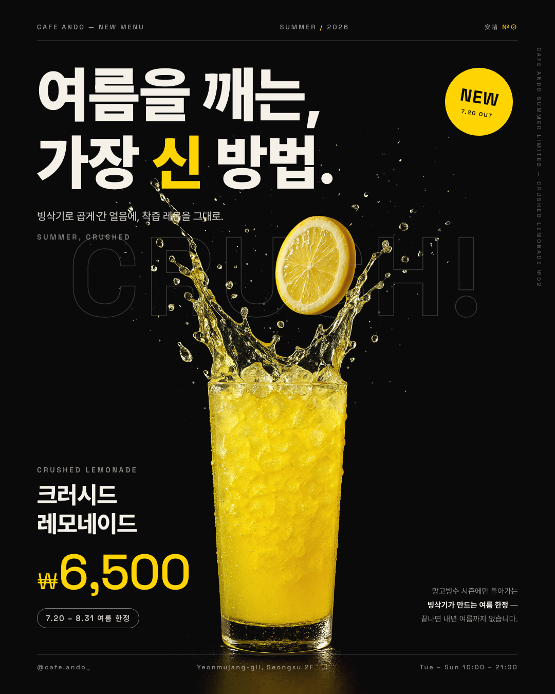

# 🍋 카페 안도 — 신메뉴 포스터 「크러시드 레모네이드」

week-7 퀘스트: 신메뉴 정의 → 후킹 카피 → 1080×1350 포스터 → 게시.
[cafe-menu-board](../cafe-menu-board/)에서 확립한 카페 안도 다크 브랜딩 위에, 채도 높은 **포인트 컬러 1개(레몬 옐로)**를 투입했다.



---

## Part 1 — 신메뉴 정의

| 항목 | 내용 |
|---|---|
| 메뉴 이름 | **크러시드 레모네이드 (Crushed Lemonade)** |
| 가격 | ₩6,500 |
| 한 줄 설명 | 빙삭기로 곱게 간 얼음에, 착즙 레몬을 그대로 부은 파쇄 레모네이드 |
| 사야 하는 이유 | **여름 시즌 한정 (7.20 – 8.31)** — 망고빙수 시즌에만 돌아가는 빙삭기가 만드는 메뉴라, 끝나면 내년 여름까지 없다 |

> 설정 근거: my_cafe.md의 "여름 신메뉴 장비(제빙기 증설·빙삭기) 사입" 로어 + 기존 여름 한정 망고빙수(7–8월)와 같은 시즌 러닝.

## Part 2 — 후킹 포인트

- **메인 카피**: **"여름을 깨는, 가장 신 방법."** — 신맛(sour)과 신메뉴(新)의 이중 의미. '깨는'은 더위 깨부수기 + 얼음 파쇄(crush)로 비주얼과 직결
- **보조 정보**: ₩6,500 · 7.20 – 8.31 여름 한정

## Part 3 — 디자인 (1080×1350)

- **비주얼 50%+**: 스플래시 히어로가 세로 370→1350px(화면 ~65%)을 차지. 크라운 스플래시 + 공중 레몬 슬라이스가 카피의 "깨는"을 시각화
- **빅 타이포**: Pretendard 900 116px 2줄 상단 스택 (피사체가 중앙 하단이므로 텍스트는 상단 — insta-ad-card에서 배운 패턴)
- **포인트 컬러 1개**: 레몬 옐로 `#FFD400` — 카피의 "신", NEW 스티커, ₩6,500에만 집중 사용. 베이스는 브랜드 그래파이트 `#0A0A0B` + 크림 `#F5F0E8`
- **브랜드 연속성**: 스펙 바 · 아웃라인 타이포(CRUSH!) · 세로 엣지 텍스트 · Space Grotesk 라벨 — 메뉴판과 같은 시스템
- 순흑 배경 제품사진을 `mix-blend-mode: lighten`으로 캔버스에 융합, 가격/기간은 작아도 명확하게(옐로 96px + 칩)

### 산출물

- `out/poster.png` — 1080×1350 (인스타 4:5)
- `out/poster@2x.png` — 2160×2700

## 이미지 생성 (fal.ai → OpenAI 폴백)

`generate-hero.mjs` — fal.ai(`flux/dev`) 우선 구조. 2026-07-19 현재 fal 잔액 소진(`403 Exhausted balance`)이라 **gpt-image-1 폴백**으로 2컷(A 스플래시 / B 빙삭 정물) 생성, **A 스플래시 컷 채택**. fal 충전 후 재실행하면 fal 4컷으로 교체 가능.

## 재현

```bash
node generate-hero.mjs   # 히어로 컷 생성 (fal.ai → OpenAI 폴백)
./render.sh              # poster.html → out/*.png (헤드리스 Chrome, zombie-safe kill)
```

---

## 제출용 — 컨셉 한 단락

> 크러시드 레모네이드는 카페 안도의 여름 한정 신메뉴다. 망고빙수 시즌에만 돌아가는 빙삭기로 얼음을 곱게 갈아 착즙 레몬을 그대로 붓는다 — "여름을 깨는, 가장 신 방법"이라는 카피는 더위를 깨부수는 파쇄 얼음(crush)과 신맛·신메뉴(新)의 이중 의미를 겹친 것이다. 포스터는 카페 안도의 그래파이트 다크 브랜딩 위에 채도 높은 레몬 옐로 단 한 색만 투입해, 검은 스튜디오에서 터지는 스플래시 한 컷으로 5초 안에 시선을 잡도록 설계했다.
